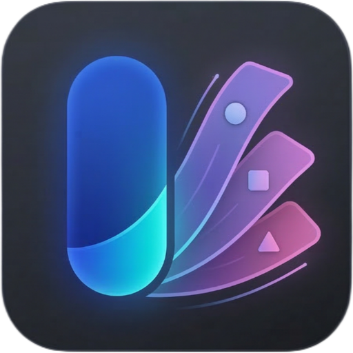

# Smart Edge: Sidebar & Gestures ✨

  

  <b>A highly customizable Android side panel inspired by OriginOS.</b> 
  Access your favorite apps, tools, and shortcuts with a single swipe.

  
  
  
  

---

## ✨ Features

*   **🎨 Custom UI Themes:** Choose from **OriginOS**, **HyperOS (Glass)**, **Realme UI**, and **Rich UI** styles.
*   **🫧 Glassmorphic Blur:** High-quality real-time background blur with **adjustable intensity** (Optimized for Android 12+).
*   **🌈 Material You:** Full support for dynamic accent colors and Material 3 components (Supports Android 12+ dynamic colors).
*   **🚀 Smart App Picker:** Integrated search and management system to pin your most-used apps.
*   **🛠️ Utility Tools:** Built-in tools like **Screenshot** (one-tap), **Home**, and **Recent Apps** shortcuts.
*   **🍃 Premium Motion:** Physics-based spring animations with customizable feel (Calm to Instant).
*   **📱 Edge Gestures:** Responsive edge-swipe triggers with adjustable height, width, and position.
*   **🎭 Icon Customization:** Full support for **Icon Packs** and custom icon shapes (Circle, Squircle, Square).

## 🚀 How to Use

1.  **Install:** Download and install the latest APK.
2.  **Permissions:** 
    *   Grant **"Display over other apps"** to allow the panel to float.
    *   Enable **"Accessibility Service"** for gesture auto-close and system shortcuts.
3.  **Setup:** Open the app and click **"Start"** to activate the service.
4.  **Gesture:** Swipe from the edge of your screen (where the pill is) to open your new panel!

## ⚙️ Customization

Smart Edge is built to be yours. In the settings, you can adjust:
*   **Interaction:** Gesture sensitivity, haptic feedback, and tap-to-open behavior.
*   **Animation:** Choose your preferred animation speed (Calm, Balanced, or Snappy).
*   **Appearance:** Background opacity, corner radius, blur intensity, and grid columns.
*   **Position:** Move the trigger handle to either the left or right side and adjust its vertical offset.

## 🔧 Requirements

*   **Android 8.0 (API 26) or higher:** Standard requirement for core functionality.
*   **Accessibility Service:** Required for the "Gesture Auto-Close" feature and system navigation shortcuts.
*   **Android 12+:** Recommended for native real-time background blur and Material You dynamic color support.

## 🛠️ Technical Details

*   **Kotlin:** Written entirely in Kotlin for safety and performance.
*   **Spring Physics:** Powered by `androidx.dynamicanimation` for natural, fluid motion.
*   **Material 3:** Implements the latest Material Design components and styling.
*   **Clean Architecture:** Separated concerns between Service, Repository, and UI layers.
*   **Optimized Rendering:** Uses hardware-accelerated layers and LruCache for smooth, lag-free icon loading.

## 📄 License

This project is licensed under the MIT License - see the [LICENSE](LICENSE) file for details.

---

  Made with ❤️ by Imtiaz

